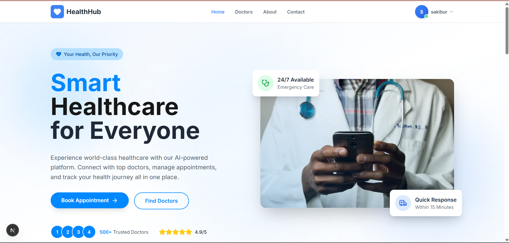

# 🏥 HealthHub - Smart Hospital Management Platform

<p align="center">
  
  
  
  
  
  
</p>

<p align="center">
A modern full-stack Hospital Management System that connects Patients, Doctors and Administrators through a secure, scalable and user-friendly healthcare platform.
</p>

---

## 🚀 Live Demo

**Frontend:** [https://healthhub-client-mu.vercel.app](https://healthhub-client-mu.vercel.app)
---

# 📑 Table of Contents

- Overview
- Features
- Tech Stack
- System Architecture
- Folder Structure
- Installation
- Environment Variables
- Database Setup
- Running the Project
- User Roles
- API Modules
- Future Improvements
- Screenshots
- Deployment
- Contributing
- License
- Author

---

# 📖 Overview

HealthHub is a modern healthcare management platform designed to simplify hospital operations.

The system allows:

- Patients to book appointments online.
- Doctors to manage schedules and patients.
- Administrators to manage the complete hospital.

The project is developed using modern full-stack technologies with secure authentication, role-based authorization, payment integration and responsive UI.

---

# ✨ Features

## 👤 Patient Features

- Secure Registration & Login
- JWT Authentication
- Browse Doctors
- Search by Specialization
- Filter Doctors
- Online Appointment Booking
- Appointment Rescheduling
- Appointment Cancellation
- Medical History
- Download Medical Reports
- Stripe Payment Integration
- View Payment History
- Personal Dashboard
- Profile Management
- Notifications
- Responsive UI

---

## 👨‍⚕️ Doctor Features

- Doctor Dashboard
- Appointment Management
- Daily Schedule
- Availability Management
- Patient Information
- Consultation Status
- Earnings Dashboard
- Medical History Access
- Profile Update
- Analytics

---

## 👨‍💼 Admin Features

- Admin Dashboard
- User Management
- Doctor Approval
- Patient Management
- Appointment Monitoring
- Revenue Analytics
- Hospital Statistics
- Platform Settings
- Manage Departments
- Manage Specializations

---

## 🔒 Security Features

- JWT Authentication
- Password Hashing using Bcrypt
- Role Based Access Control
- Protected Routes
- API Authorization
- Secure Stripe Payment
- Environment Variable Protection
- Middleware Authentication

---

# 💻 Tech Stack

## Frontend

| Technology | Purpose |
|------------|----------|
| Next.js 16 | React Framework |
| TypeScript | Type Safety |
| Tailwind CSS | Styling |
| HeroUI | UI Components |
| Framer Motion | Animations |
| React Hook Form | Form Handling |
| React Hot Toast | Notifications |
| Axios | API Requests |
| Lucide React | Icons |

---

## Backend

| Technology | Purpose |
|------------|----------|
| Express.js | REST API |
| Node.js | Runtime |
| TypeScript | Type Safety |
| MongoDB | Database |
| JWT | Authentication |
| BcryptJS | Password Encryption |
| Stripe | Payments |
| CORS | Cross-Origin Support |
| Dotenv | Environment Variables |

---

# 🏗️ System Architecture

```
                ┌────────────────────┐
                │     Frontend       │
                │     Next.js 16     │
                └─────────┬──────────┘
                          │
                    REST API
                          │
                ┌─────────▼──────────┐
                │    Express Server  │
                └─────────┬──────────┘
                          │
          ┌───────────────┼────────────────┐
          │               │                │
     Authentication   Stripe API      MongoDB
          │               │                │
      JWT + Bcrypt      Payments       Database
```

---

# 📁 Project Structure

```text
healthhub
│
├── backend
│   ├── src
│   │   ├── config
│   │   ├── controllers
│   │   ├── middleware
│   │   ├── models
│   │   ├── routes
│   │   ├── services
│   │   ├── utils
│   │   ├── types
│   │   ├── scripts
│   │   └── server.ts
│   │
│   ├── package.json
│   └── tsconfig.json
│
├── frontend
│   ├── src
│   │   ├── app
│   │   ├── components
│   │   ├── hooks
│   │   ├── context
│   │   ├── services
│   │   ├── lib
│   │   ├── types
│   │   └── utils
│   │
│   ├── package.json
│   └── tailwind.config.ts
│
└── README.md
```

---

# ⚙️ Installation

## Clone Repository

```bash
git clone https://github.com/Sakibur59/SCIC-Assignment-03-ts.git

cd healthhub
```

---

## Install Backend

```bash
cd backend

npm install
```

---

## Install Frontend

```bash
cd ../frontend

npm install
```

---

# 🔑 Environment Variables

## Backend (.env)

```env
PORT=5000

MONGODB_URI=mongodb://localhost:27017

DB_NAME=healthhub

JWT_SECRET=your_secret_key

JWT_EXPIRE=7d

CLIENT_URL=http://localhost:3000

STRIPE_SECRET_KEY=sk_test_xxxxxxxxx

STRIPE_WEBHOOK_SECRET=whsec_xxxxxxxxx
```

---

## Frontend (.env.local)

```env
NEXT_PUBLIC_API_URL=http://localhost:5000/api

NEXT_PUBLIC_STRIPE_PUBLISHABLE_KEY=pk_test_xxxxxxxxx
```

---

# 💾 Database Setup

Run MongoDB locally.

Seed sample data:

```bash
cd backend

npm run seed
```

Or manually insert data.

---

# 🚀 Running the Project

## Backend

```bash
cd backend

npm run dev
```

Backend URL

```
http://localhost:5000
```

---

## Frontend

```bash
cd frontend

npm run dev
```

Frontend URL

```
http://localhost:3000
```

---

# 🏥 User Roles

## 👤 Patient

- Register
- Login
- Book Appointment
- Pay Online
- Download Medical Reports
- View Doctors
- Cancel Appointment
- Reschedule Appointment

---

## 👨‍⚕️ Doctor

- Manage Schedule
- Confirm Appointment
- Complete Consultation
- Cancel Appointment
- Update Availability
- Manage Profile
- View Earnings

---

## 👨‍💼 Admin

- Manage Doctors
- Manage Patients
- Manage Appointments
- Manage Payments
- Manage Departments
- Analytics Dashboard

---

# 🔌 API Modules

```
Authentication API

Doctor API

Patient API

Appointment API

Payment API

Admin API

Dashboard API

Profile API

Notification API
```

---

# 📸 Screenshots



---

# 🚀 Future Improvements

- Video Consultation
- AI Symptom Checker
- Online Prescription
- Medicine Delivery
- Email Notifications
- SMS Notifications
- Push Notifications
- Real-time Chat
- Ambulance Tracking
- Hospital Inventory
- Laboratory Module
- Insurance Management
- Multi-language Support

---

# 🌐 Deployment

## Frontend

- Vercel

## Backend

- Render

## Database

- MongoDB Atlas

---

# 🤝 Contributing

Contributions are always welcome.

1. Fork the repository

2. Create a feature branch

```bash
git checkout -b feature/YourFeature
```

3. Commit changes

```bash
git commit -m "Added new feature"
```

4. Push

```bash
git push origin feature/YourFeature
```

5. Create Pull Request

---

# 📜 License

This project is licensed under the MIT License.

---

# 👨‍💻 Author

**Md Sakibur Rahman**

Full Stack MERN Developer

- 🌐 Portfolio: https://sakiburrahman-portfolio.vercel.app
- 💼 LinkedIn: https://www.linkedin.com/in/md-sakibur-rahman-54b5bb371
- 📧 Email: sakiburrahman5978@gmail.com

---

<p align="center">

⭐ If you like this project, don't forget to give it a star!

Made with ❤️ using Next.js, Express.js, MongoDB and TypeScript.

</p>
